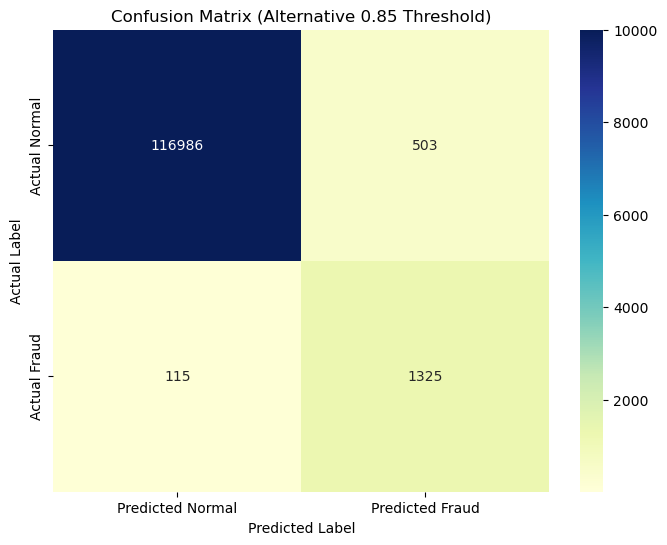
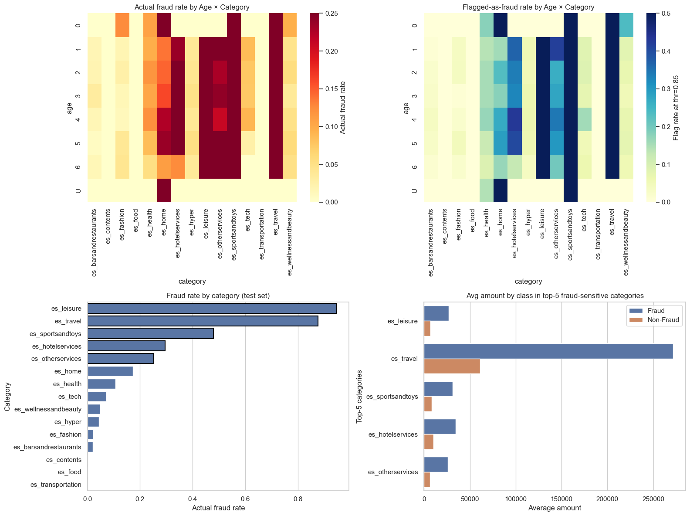

# FraudDetection_banksim
Developing a ML model that flags a transaction as fraudulent from BankSim, a synthetic dataset provided by the research paper "Lopez-Rojas, Edgar Alonso & Axelsson, Stefan. (2014). BankSim: A Bank Payment Simulation for Fraud Detection Research. 26th European Modeling and Simulation Symposium, EMSS 2014.". 

# Detecting Fraudulent transactions with a ML model

The primary goal is to build a machine learning model that can accurately identify fraudulent transactions within this synthetic dataset. The core challenge lies in the nature of fraud detection: the data is highly imbalanced, as real fraud (the positive class) accounts for a tiny fraction of all transactions. Out of 594643 transactions, only 7200 are fraudulent (1.21%). 

## BankSim data description

A spanish bank provided a sample of aggregated transaction data from which it was possible to develop the dataset «BankSim, a Bank payment Simulation, built on the concept of Multi Agent-Based Simulation (MABS)». 
For additional info related to how the synthetic data used in the Notebook was built, please refer to the research paper mentioned. 

The variables included in the BankSim dataset are:

| Variable | Description |
| :--- | :--- |
| **Step** | Represents the time granularity of the simulation, where each step represents a day of commercial activity. |
| **CustomerId** | An identifier for the customer involved in the transaction. This is information about the customer stored in the transaction log. |
| **Age** | The age category of the customer. The defined categories include: **0** ($\leq18$), **1** (19-25), **2** (26-35), **3** (36-45), **4** (46-55), **5** (56-65), **6** ($>65$), and **U** (Unknown). |
| **Gender** | The gender category of the customer. The defined categories include: **E** (ENTERPRISE), **F** (FEMALE), **M** (MALE), and **U** (UNKNOWN). |
| **zipCodeOrigin** | The zip code location corresponding to the customer's origin. |
| **merchant** | An identifier for the merchant involved in the transaction. This information is part of the transaction log. |
| **zipMerchant** | The zip code location of the merchant. |
| **category** | The merchant category for the purchased goods or services. The data is grouped into 16 merchant categories (e.g., restaurant, food, cars). |
| **amount** | The amount of the payment involved in the transaction. All prices are in euro. |
| **fraud** | The binary feature to indicate whether the transaction is fraudulent. |

## Approach followed
A model optimized for simple accuracy would be useless, since it could get a 99% score by simply flagging nothing as fraud. Therefore, this project focuses on optimizing to find the best possible balance between Precision (minimizing false positives) and Recall (catching as many real fraud cases as possible). 
The key evaluation metric used is the Area Under the Precision-Recall Curve (**PR-AUC**).

This repository contains the full analysis in the FraudDetection_banksimGP.ipynb notebook. The process can be broken down into two key phases:

1. **Feature Engineering**: 
Instead of just looking at a single transaction in isolation (raw data and features), in this project we perform some feature engineering in order to extract more useful information from the original data provided. 
As showed in the notebook, the engineered variables are the following: 
    * `log_amount`: stabilizes skewed amounts
    * `cust_txn_count_prev`: how many transactions a customer had before now
    * `cust_amt_mean_prev`: customer’s average amount before now
    * `amt_minus_cust_mean_diff`: difference between current amount and customer's historical mean amount
    * `time_since_last_cust_txn`: days since customer’s last transaction
    * `time_since_last_cust_merchant`: days since customer last used this merchant
    * `cust_merchant_txn_count_prev`: familiarity with merchant
    * `cust_category_count_prev`: familiarity with category

2. **Modeling with LightGBM**: 
A LightGBM (LGBM) Classifier was chosen for its high performance, speed, and native ability to handle categorical features without extensive preprocessing. In addition, to tackle the class imbalance, the model was trained with scale_pos_weight. This parameter effectively "punishes" the model more severely for misclassifying positive (fraud) case, forcing it to pay closer attention to the minority class.

The model's hyperparameters were tuned using RandomizedSearchCV with a focus on maximizing the average_precision (PR-AUC) score.

## Performance and Findings

The final tuned model performs very well, achieving a Test PR-AUC of 0.93 and a Test ROC-AUC of 0.998.

However, the most important finding is the practical business trade-off in **threshold-tuning**:

At the default 0.5 probability threshold, the model has fantastic Recall (96%) but poor Precision (57%). This means it catches almost all fraud, but also flags far too many legitimate transactions (false positives), which not only would turn out to be a terrible customer experience, but it would also lead to higher operational costs, since the bank which would find itself spend more resources than necessary into useless monitoring. 

By analyzing the P-R curve, we found an alternative threshold of 0.85. At this level, we find a much more practical balance:
* Precision: 72% (The model is correct almost 3/4 of the time it flags a transaction).
* Recall: 92% (It still successfully catches 9 out of 10 fraudulent transactions).

Here's the final confusion matrix: 

A simple adjustment makes the model far more useful in a real-world scenario, striking a balance between security (catching fraud) and customer convenience (avoiding false alarms).
This emphasizes how important the process of choosing the most appropriate threshold is (threshold tuning). 

### Fraudulent Transactions: What the test set shows
Top risky categories (actual fraud rate):
* Leisure: 94.74% of transactions are fraudulent in the test set
* Travel — 87.59% fraudulent
* Sports & Toys — 47.86% fraudulent

These three categories dominate the fraud mix. In the first heatmap below (Actual fraud rate by Age × Category), they appear as the darkest columns across nearly all age groups, meaning the risk isn't confined to a specific age.

Fraudulent transactions in `Travel` are not only frequent but also expensive: the average fraud amount exceeds €250k, while typical fraudulent averages in other categories sit below €50k. This suggests Travel is both high-incidence and high-severity.

Fraud is present across all age classes. No single age group is inherently “safe”.

The second heatmap below (Flagged-as-fraud rate) aligns well with the truly risky categories (Leisure, Travel, Sports & Toys). 
A few categories show divergence: some low-risk categories are flagged more than their actual fraud rate would suggest (over-flagging).

Here's the final Summary dashboard that provides a general look on the main characteristics shared by actual and flagged as fraudulent transactions: 

# How to Use This Repository

To review the full analysis: Open and run the FraudDetection_banksimGP.ipynb notebook from top to bottom.

To use the trained model: The final model (lgbm_final_refit.joblib), best parameters (lgbm_best_params.json), and the search estimator (lgbm_best_estimator.joblib) are all saved. You can load these files to make new predictions without re-running the entire training and tuning process.
